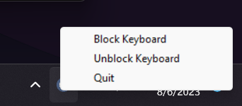
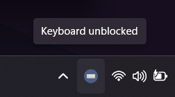
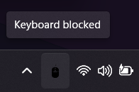

# Windows keyboard blocking utility software.

- [About](#about)
- [How it works?](#how-it-works)
- [How to run it on my system?](#how-to-run-it-on-my-system)

### About

Have you ever faced the issue of cleaning your keyboard while keeping your laptop on? Because I faced it several times and to overcome it I wrote a simple python script which I call a keyboard blocking utility software for Windows. This useful tool allows users to temporarily disable their laptop keyboard, preventing accidental key presses while wiping down the keys. With this software, users can easily clean their keyboard without having to shut down their laptop or carefully clean each key individually. This can save time and make the cleaning process more efficient.

In addition to cleaning, there are other use cases, for instance:
- Preventing Accidental key presses by someone around you (kids, pets!!),
- (fun) pranking your friends/coworkers and watch them figure out. 

### How it works?

This keyboard blocking utility software for Windows operates as follows:

<p align="center">
    <br>
    
    
</p>

**System Tray Utility**

The software functions as a system tray utility, with an icon appearing in the system tray when the script is running in the background.

**Menu Options**

Right-clicking on the system tray icon reveals a menu with the following options:

(✅ - working, 🚧 - under development) 
-  Block Keyboard✅: Selecting the “Block keyboard” option temporarily disables the laptop keyboard.
-  Unblock Keyboard✅: Selecting the “Unblock keyboard” option re-enables the laptop keyboard.
-  Quit✅: Selecting the “Quit” option exits the utility software.

### How to run it on my system?

**Prerequisites -**
- infi.systray==0.1.12
- keyboard==0.13.5

These prerequisites are typically listed in a “requirements.txt” file.

To install the prerequisites, you can use the “pip install” command. 

For example, you can open a terminal window (after cloning) and enter the command:
```powershell
pip install -r requirements.txt
```

it install all the prerequisites listed in the “requirements.txt” file. Once the prerequisites are installed, you can proceed with running the application.

To run keyboard blocking utility software for Windows, you can follow these steps:

1. **Clone the repository:** Clone the software repository onto your system.
2. **Open terminal:** Open a terminal, PowerShell, or command prompt window.
3. **Run the application:** Run the application by entering the command 
```powershell
python3 keyboard_blocker.py
```

4. **System tray icon:** After running the application, you should see a system tray icon appear.

Once the system tray icon is visible, you can access the menu options by right-clicking on the icon. From there, you can choose to block or unblock the keyboard, or quit the utility software.

### More 🚧:
- The keyboard hotkeys/shortcuts like (Ctrl+Shift+Esc, etc.) are not blocked using the script (will figure it out),
- Some Fn keys (multi-function keys) specifically F4,F5,F6 are not blocked (maybe because of the logic I used in script is not ideal)

If you are using this for any purpose feel free to star(⭐) the repository.

Any contributions, new issues are appreciated by me, feel free to do so.
